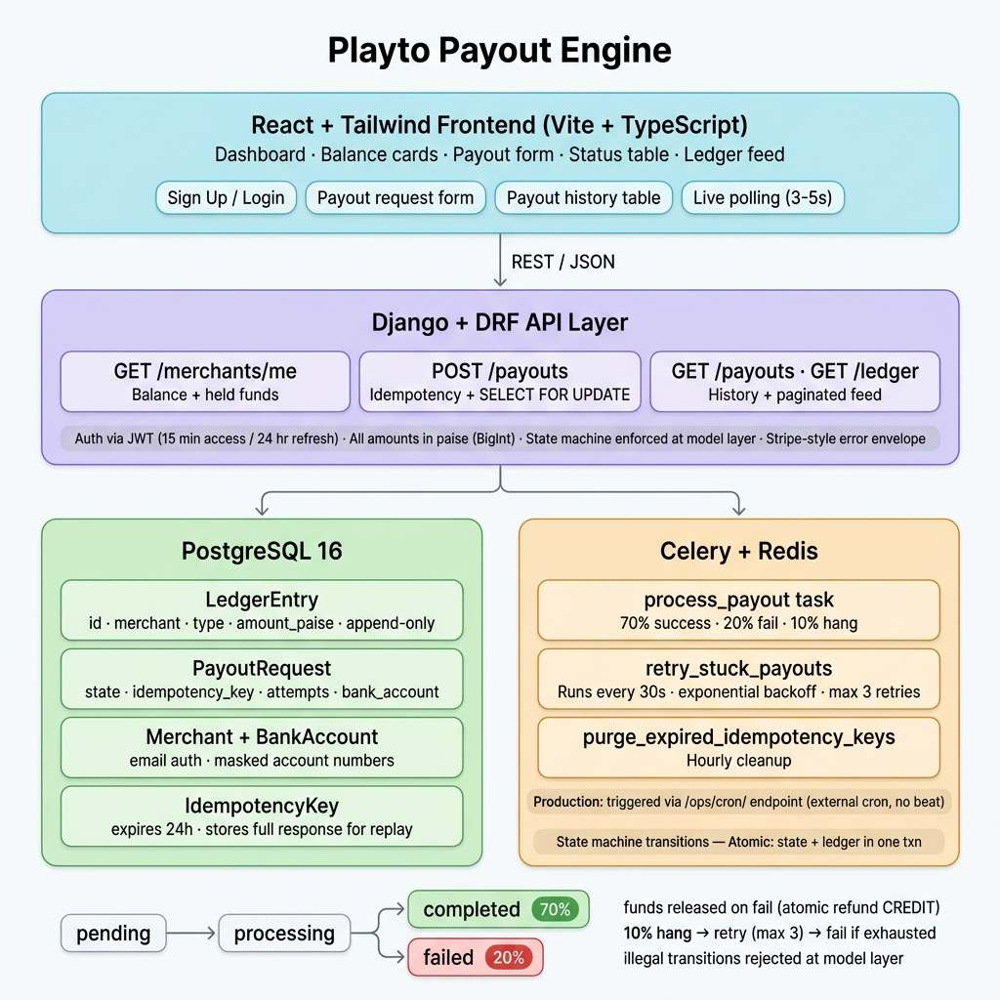

# Playto Payout Engine

> Production-grade payout engine for Indian merchants. Collects payments, manages balances via an immutable ledger, and processes INR payouts to bank accounts — built with Stripe-level engineering: row-level locking, model-layer state machines, byte-perfect idempotency, and atomic failure refunds.

## 🔗 Live Demo

| Service | URL |
|---|---|
| **Frontend** | [playto-frontend-m4j7.onrender.com](https://playto-frontend-m4j7.onrender.com/) |
| **Backend API** | [playto-api-550a.onrender.com](https://playto-api-550a.onrender.com) |

> Create an account and pick a business persona to seed demo data.

---

## Stack

| Layer | Technology |
|---|---|
| Frontend | React 19 + Tailwind CSS v4 + Vite + TypeScript |
| Backend | Django 5.2 + Django REST Framework |
| Database | PostgreSQL 16 (`SELECT FOR UPDATE` row-level locking) |
| Task Queue | Celery 5.6 + Redis 7 |
| Auth | JWT via djangorestframework-simplejwt |
| Deployment | Render (free tier) |

---

## Architecture



For a deep-dive into how everything works, read **[EXPLAINER.md](./EXPLAINER.md)**.

---

## Key Design Decisions

- **No balance column** — Balance = `SUM(CREDIT) - SUM(DEBIT)` from the append-only ledger. No mutable state to corrupt.
- **PostgreSQL required** — `SELECT FOR UPDATE` row locks prevent concurrent payout double-spend. SQLite silently ignores this.
- **State machine in the model** — `PayoutRequest.transition_to()` enforces legal transitions, acquires row locks, and creates atomic refund credits on failure.
- **Stripe-style idempotency** — Every mutation needs an `Idempotency-Key` header. Full responses are stored for byte-perfect replay.
- **Money as integers** — All amounts in paise (integer). No floats anywhere. Display uses `//` and `%`.

---

## Local Setup

### Docker Compose (recommended)

```bash
# Start PostgreSQL + Redis
docker compose up -d db redis

# Backend
cd backend
python -m venv ../.venv && source ../.venv/bin/activate
pip install -r requirements.txt
python manage.py migrate
python manage.py seed_merchants
python manage.py runserver

# Celery (separate terminals)
celery -A config worker -l info
celery -A config beat -l info

# Frontend
cd frontend
npm install
npm run dev
```

### Full Stack (single command)

```bash
docker compose up -d
```

Dashboard → `http://localhost:5173` — sign up, pick a persona, start creating payouts.

---

## Running Tests

```bash
cd backend

# All tests (requires PostgreSQL)
python manage.py test

# Specific modules
python manage.py test payouts.tests   # concurrency, idempotency, state machine, balance
python manage.py test workers.tests   # stuck-payout retry, worker idempotency, cleanup
```

---

## API Quick Test (curl)

```bash
# 1. Login
TOKEN=$(curl -s -X POST http://127.0.0.1:8000/api/v1/auth/token/ \
  -H 'Content-Type: application/json' \
  -d '{"username": "rahul", "password": "playto12345"}' | python3 -c "import sys,json; print(json.load(sys.stdin)['access'])")

# 2. Check balance
curl -s http://127.0.0.1:8000/api/v1/merchants/me/ \
  -H "Authorization: Bearer $TOKEN" | python3 -m json.tool

# 3. List bank accounts
curl -s http://127.0.0.1:8000/api/v1/bank-accounts/ \
  -H "Authorization: Bearer $TOKEN" | python3 -m json.tool

# 4. Create payout (replace BANK_ACCOUNT_ID)
curl -s -X POST http://127.0.0.1:8000/api/v1/payouts/ \
  -H "Authorization: Bearer $TOKEN" \
  -H "Content-Type: application/json" \
  -H "Idempotency-Key: $(uuidgen)" \
  -d '{"amount_paise": 50000, "bank_account_id": "BANK_ACCOUNT_ID"}' | python3 -m json.tool
```

---

## Deployment

Deployed on **Render** (free tier) via `render.yaml`:

- **playto-api** — Docker service running Django + Celery worker in one container
- **playto-frontend** — Static site (Vite build output)
- **playto-db** — Managed PostgreSQL
- **playto-redis** — Managed Redis
- Periodic tasks triggered via external cron service hitting `/ops/cron/`

---

## Documentation

- **[EXPLAINER.md](./EXPLAINER.md)** — Full technical deep-dive: ledger, locking, idempotency, state machine, workers, deployment, tests, and the AI bug fix.
